# Relatório Técnico — AOC Laboratório de Circuitos

<!-- Rascunho-fonte. Ao finalizar, exportar para relatorio_tecnico.pdf (nome exigido pelo enunciado). -->

## 1. Introdução

## 2. Parte I — Subsistema de memória

O módulo de memória está em `parte1_memoria.circ`. A cache, o somador de endereço e o teste de conflito estão em `parte1_cache.circ`.

### 2.1 Módulo de memória (mapa de memória e tabela verdade dos CS)

O barramento de endereços tem 6 bits (A5..A0) e o de dados, 8 bits. A5 e A4 entram em um decodificador 2→4, feito com portas NOT e AND, que escolhe uma entre quatro regiões de 16 bytes. A3..A0 escolhem a posição dentro da região. O mapa de memória está na Tabela 1, e a Tabela 2 mostra que exatamente um sinal CS fica ativo em cada combinação de A5 e A4.

**Tabela 1 — Mapa de memória.**

| Faixa | Dispositivo | Tamanho | Sinal de seleção |
|---|---|---|---|
| 0x00 – 0x0F | ROM de programa | 16 bytes | CS_ROM = A5' · A4' |
| 0x10 – 0x1F | RAM de dados | 16 bytes | CS_RAM = A5' · A4 |
| 0x20 – 0x2F | Banco de registradores | 16 bytes | CS_REG = A5 · A4' |
| 0x30 – 0x3F | Região de E/S | 16 bytes | CS_IO = A5 · A4 |

**Tabela 2 — Tabela verdade dos sinais de seleção.**

| A5 | A4 | CS_ROM | CS_RAM | CS_REG | CS_IO |
|---|---|---|---|---|---|
| 0 | 0 | 1 | 0 | 0 | 0 |
| 0 | 1 | 0 | 1 | 0 | 0 |
| 1 | 0 | 0 | 0 | 1 | 0 |
| 1 | 1 | 0 | 0 | 0 | 1 |

A escrita em cada dispositivo é habilitada por `CS · Escrita`; a ROM não é gravável. As saídas dos quatro dispositivos são reunidas pelo multiplexador de 4 entradas (Componente 02), comandado por A5 e A4, cuja saída é o pino `DadoLido`. A ROM (Componente 05) e as RAMs de dados e de E/S (Componente 06) são memórias 16 × 8 da biblioteca, endereçadas por A3..A0. O banco de registradores (Componente 07) tem 16 registradores de 8 bits, um decodificador 4→16 para a escrita e um multiplexador de 16 entradas para a leitura. Os pinos estão nas Tabelas 3 a 5, e os circuitos, nas Figuras 1 e 2. As memórias e o multiplexador de saída aparecem nas Figuras 12 a 14.

**Tabela 3 — Pinos do módulo de memória (`main` de `parte1_memoria.circ`).**

| Pino | Direção | Bits | Função |
|---|---|---|---|
| Endereco | entrada | 6 | Endereço A5..A0 |
| DataEscrita | entrada | 8 | Dado a gravar |
| Escrita | entrada | 1 | Habilita a escrita no dispositivo selecionado |
| CLOCK | entrada | 1 | Relógio de escrita |
| DadoLido | saída | 8 | Saída do multiplexador |
| CS_ROM, CS_RAM, CS_REG, CS_IO | LED | 1 cada | Região selecionada |
| ErroParidade | LED | 1 | Erro de paridade na leitura da RAM |

**Tabela 4 — Pinos do subcircuito `Decodificador`.**

| Pino | Direção | Bits | Função |
|---|---|---|---|
| A5, A4 | entrada | 1 cada | Bits mais significativos do endereço |
| CS_ROM, CS_RAM, CS_REG, CS_IO | saída | 1 cada | Equações da Tabela 1 |

**Tabela 5 — Pinos do subcircuito `BancoDeRegistradores`.**

| Pino | Direção | Bits | Função |
|---|---|---|---|
| RegWrite | entrada | 1 | CS_REG · Escrita |
| Endereco | entrada | 4 | A3..A0 |
| DadoEscrita | entrada | 8 | Dado a gravar |
| Clock | entrada | 1 | Relógio |
| DadoLido | saída | 8 | Registrador endereçado |

**Figura 1 — Circuito do decodificador de endereços.**

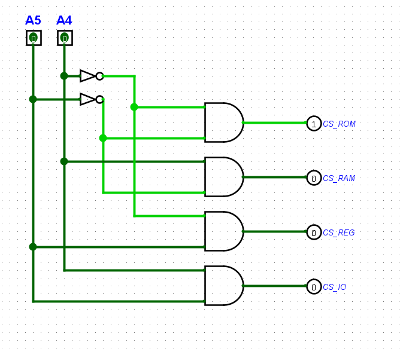

**Figura 2 — Circuito do banco de registradores.**

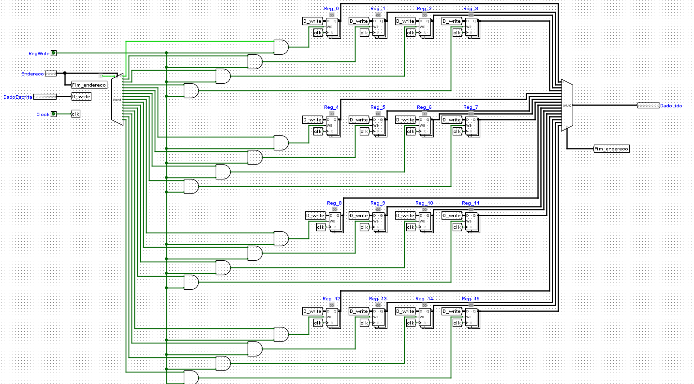

### 2.2 Bit de paridade

Cada palavra gravada na RAM recebe um bit de paridade ímpar, guardado numa RAM separada de 16 posições de 1 bit. O detector de paridade ímpar (Componente 14) é a porta *Odd Parity* de 8 entradas, e o bit gravado é `p = NOT(OddParity(dado))`. Na leitura, o bit é recalculado e comparado com o guardado por uma XOR: `ErroParidade = (p_guardado XOR p_recalculado) · CS_RAM`. O funcionamento é mostrado no teste T-02 (Tabela 12).

### 2.3 Cache (divisão do endereço e comparador de rótulos)

A cache tem mapeamento direto, 4 linhas e blocos de 2 bytes, e atende somente leituras. O endereço se divide em três campos (Tabela 6):

- deslocamento = log₂(tamanho do bloco) = log₂(2) = 1 bit → A0;
- índice = log₂(número de linhas) = log₂(4) = 2 bits → A2 A1;
- rótulo = 6 − 2 − 1 = 3 bits → A5 A4 A3.

**Tabela 6 — Divisão do endereço.**

| Campo | Bits | Largura |
|---|---|---|
| Rótulo | A5 A4 A3 | 3 |
| Índice | A2 A1 | 2 |
| Deslocamento | A0 | 1 |

Exemplo: 0x22 = 100010, com deslocamento 0, índice 01 e rótulo 100. Esse endereço só pode ocupar a linha 1, onde será registrado o rótulo 100.

O endereço é calculado pelo somador de 8 bits (Componente 08) como `Base + Deslocamento`. O somador tem a largura da palavra do sistema (8 bits), e só os bits 5..0 da soma são usados como endereço.

Cada linha tem um registrador de rótulo de 3 bits e um bit de validade feito com flip-flop JK (Componente 01), com J = falta da linha e K = 0. O pino `zerar` aciona o reset dos registradores e dos flip-flops, invalidando a cache (Figura 4). O sinal de falta de cada linha é `Falha_Lx = decodificador[x] · NOT(Acerto) · Acesso`, e ele habilita a escrita do rótulo na borda do clock. O pino `Acesso` indica se a borda do clock é um acesso de leitura: no `main` ele vale 1, e no teste da Seção 2.5 ele recebe a saída do detector de primos.

O comparador de rótulos usa três XOR feitas com AND, OR e NOT (Componente 03), sem comparador da biblioteca (Figura 3):

`iguais = NOT( (T2 XOR S2) OR (T1 XOR S1) OR (T0 XOR S0) )`

`ACERTO = iguais · valido[índice]`

Um contador de 4 bits, habilitado por `Acerto · Acesso`, conta os acertos e alimenta o decodificador de 7 segmentos (Componente 16), que mostra o valor no display (Figura 5). Os pinos estão na Tabela 7.

**Tabela 7 — Pinos do `main` e do subcircuito `cache` (`parte1_cache.circ`).**

| Pino | Onde | Direção | Bits | Função |
|---|---|---|---|---|
| Base | main | entrada | 8 | Operando do somador |
| Deslocamento | main | entrada | 8 | Operando do somador |
| Clock | main | entrada | 1 | Conclui o acesso na borda de subida |
| Zerar | main | entrada | 1 | Invalida a cache e zera o contador |
| Endereco | cache | entrada | 6 | Bits 5..0 da soma |
| Acesso | cache | entrada | 1 | 1 = a borda do clock é um acesso |
| acerto | cache | saída | 1 | 1 = acerto |

**Figura 3 — Comparador de rótulos com XOR sintetizado.**

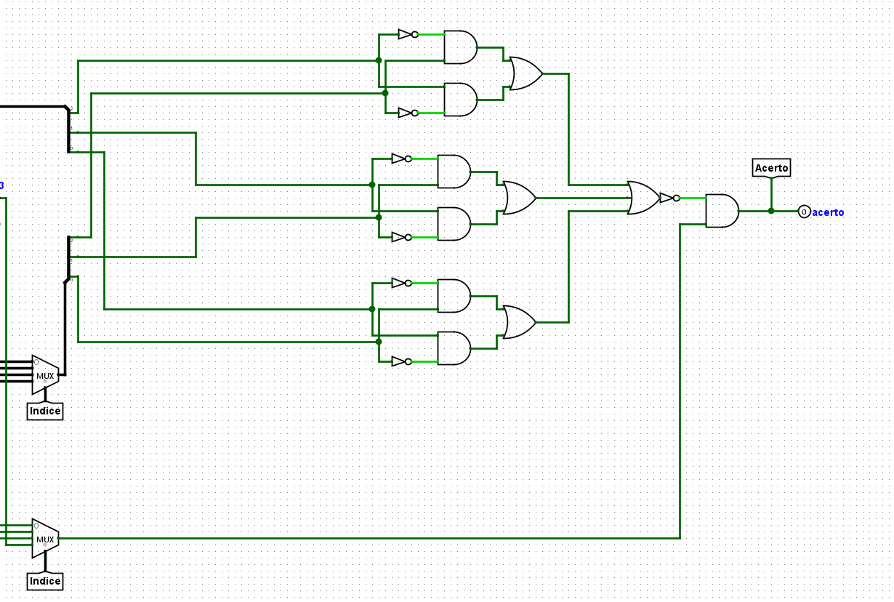

**Figura 4 — Cache logo após o `zerar`: bits de validade em 0.**

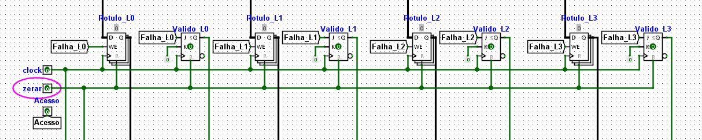

### 2.4 Planilha e indicadores

A planilha `parte1_planilha.xlsx` traz os 16 acessos do traço, com as colunas derivadas por fórmula. Os indicadores estão na Tabela 8. O circuito confirma o resultado: ao final do traço, o display mostra 8 acertos (Figura 5).

**Tabela 8 — Indicadores do traço.**

| Indicador | Expressão | Valor |
|---|---|---|
| Acertos | contagem de ACERTO | 8 |
| Faltas | contagem de FALTA | 8 |
| Taxa de acertos | 8 ÷ 16 | 50% |
| Faltas compulsórias | contagem de "compulsoria" | 4 |
| Faltas por conflito | contagem de "conflito" | 4 |
| AMAT | tempo de acerto + taxa de faltas × penalidade = 1 + 0,5 × 8 | 5 ciclos |

**Figura 5 — Display de sete segmentos após os 16 acessos do traço (8 acertos).**

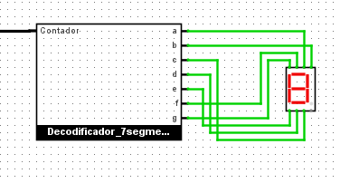

### 2.5 Teste de conflito (detector de primos)

Um contador síncrono de 3 bits percorre v = 0 a 7. O detector de primos de 4 bits (Componente 17) recebe A = 0 e B, C, D = v, e sua saída vai ao pino `Acesso` da cache, de modo que só os valores primos geram acesso. O endereço é `v << 3`. Minimizando pelo mapa de Karnaugh (primos 2, 3, 5, 7, 11 e 13), a equação do detector é:

`P = A'B'C + A'BD + B'CD + BC'D`

Os pinos do detector estão na Tabela 9, o circuito na Figura 6, o resultado do teste na Tabela 10 e o estado final na Figura 7.

**Tabela 9 — Pinos do subcircuito `DetectorPrimos`.**

| Pino | Direção | Bits | Função |
|---|---|---|---|
| A, B, C, D | entrada | 1 cada | Número de 4 bits (A é o mais significativo) |
| Primo | saída | 1 | 1 se o número é primo |

**Figura 6 — Circuito do detector de primos.**

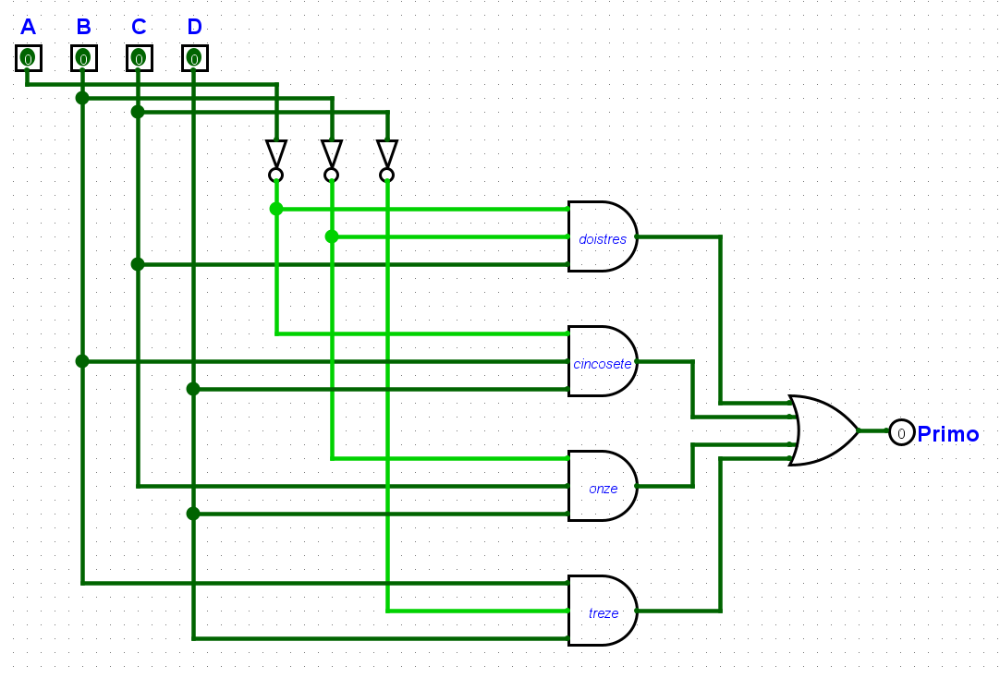

**Tabela 10 — Teste de conflito, começando com a cache invalidada.**

| v | Endereço | Binário | Rótulo | Índice | Resultado |
|---|---|---|---|---|---|
| 2 | 0x10 | 010000 | 010 | 00 | FALTA (compulsória) |
| 3 | 0x18 | 011000 | 011 | 00 | FALTA (conflito) |
| 5 | 0x28 | 101000 | 101 | 00 | FALTA (conflito) |
| 7 | 0x38 | 111000 | 111 | 00 | FALTA (conflito) |

**Figura 7 — Contador de acertos e display da instância da cache usada no `ConflitoPrimos`, após os oito clocks do teste (0 acertos).**

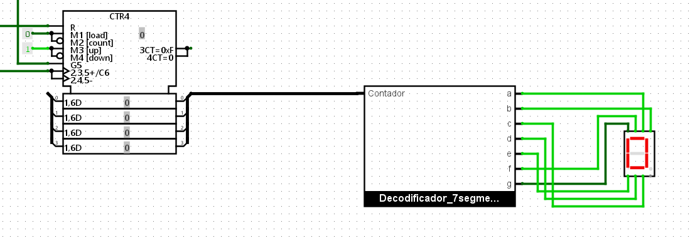

**Por que a regra produz esse resultado.** Deslocar v três posições à esquerda coloca v em A5A4A3, que é o rótulo, e zera A2A1A0. Assim, o índice (A2A1) é sempre 00: os quatro endereços disputam a linha 0 com rótulos diferentes, cada um expulsa o anterior, e não há nenhum acerto, mesmo com três linhas ociosas.

**Com oito linhas.** O índice passaria a ter 3 bits (A3A2A1) e o rótulo, 2 bits. Como A3 = v0 e A2A1 = 00, o índice seria 000 para v = 2 e 100 para v = 3, 5 e 7. O endereço 0x10 ficaria sozinho na linha 0, mas 0x18, 0x28 e 0x38 continuariam disputando a linha 4. Dobrar as linhas não elimina o conflito, porque a regra `v << 3` só faz variar um bit do índice.

### 2.6 Testes (T-01 a T-05)

As Tabelas 11 a 13 registram as entradas, as saídas esperadas e as observadas em cada teste. As capturas de tela estão nas Figuras 8 a 18.

**Tabela 11 — T-01, seleção de região (`parte1_memoria.circ`).**

| Endereco | A5A4 | Esperado | Observado | Figura |
|---|---|---|---|---|
| 0x00 | 00 | só CS_ROM ativo | só CS_ROM aceso | 8 |
| 0x10 | 01 | só CS_RAM ativo | só CS_RAM aceso | 9 |
| 0x20 | 10 | só CS_REG ativo | só CS_REG aceso | 10 |
| 0x30 | 11 | só CS_IO ativo | só CS_IO aceso | 11 |

**Figura 8 — T-01, A5A4 = 00.**

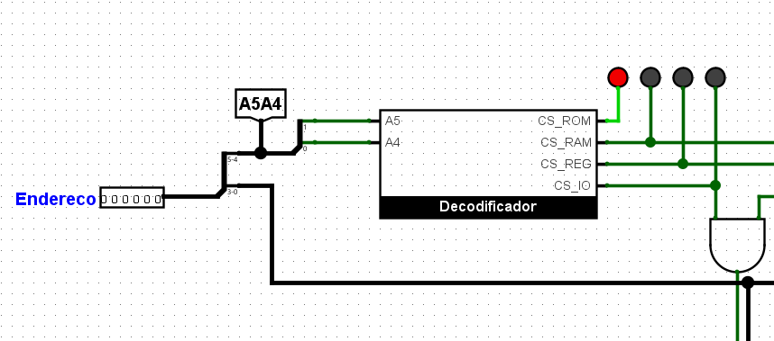

**Figura 9 — T-01, A5A4 = 01.**

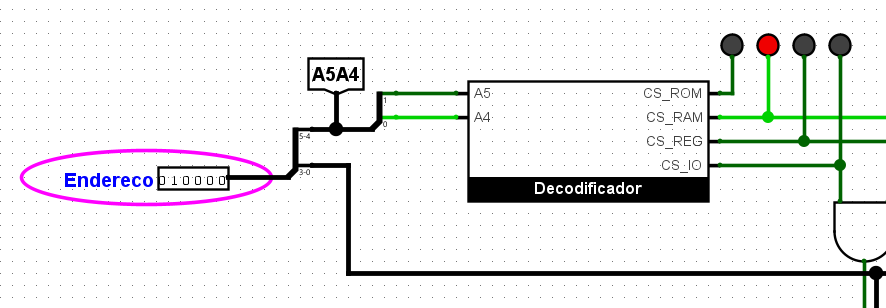

**Figura 10 — T-01, A5A4 = 10.**

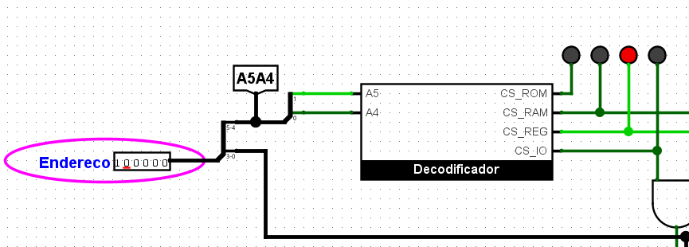

**Figura 11 — T-01, A5A4 = 11.**

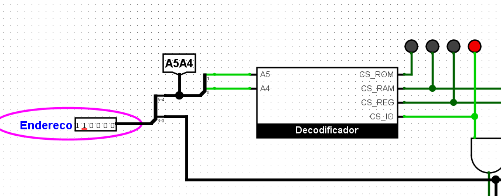

**Tabela 12 — T-02, erro de paridade (`parte1_memoria.circ`).**

| Passo | Entradas | Esperado | Observado | Figura |
|---|---|---|---|---|
| Gravar | Endereco = 0x11, DataEscrita = 0x55, Escrita = 1, pulso em CLOCK | RAM[1] = 0x55, paridade = 1 | RAM[1] = 55, paridade[1] = 1 | 12 |
| Ler | Endereco = 0x11, Escrita = 0 | DadoLido = 0x55, sem erro | DadoLido = 01010101, LED apagado | 13 |
| Inverter um bit e ler | RAM[1] editada para 0x54 | DadoLido = 0x54, erro aceso | DadoLido = 01010100, LED aceso | 14 |

**Figura 12 — T-02, gravação de 0x55 em 0x11.**

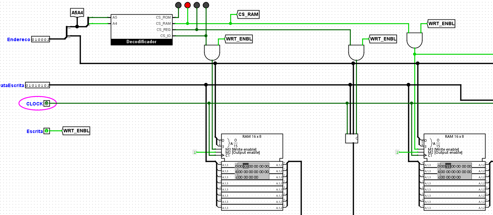

**Figura 13 — T-02, leitura de 0x55 sem erro.**

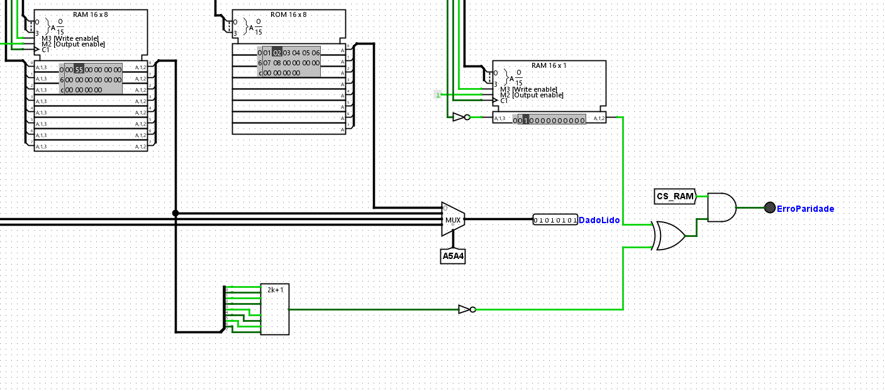

**Figura 14 — T-02, leitura de 0x54 com erro de paridade.**

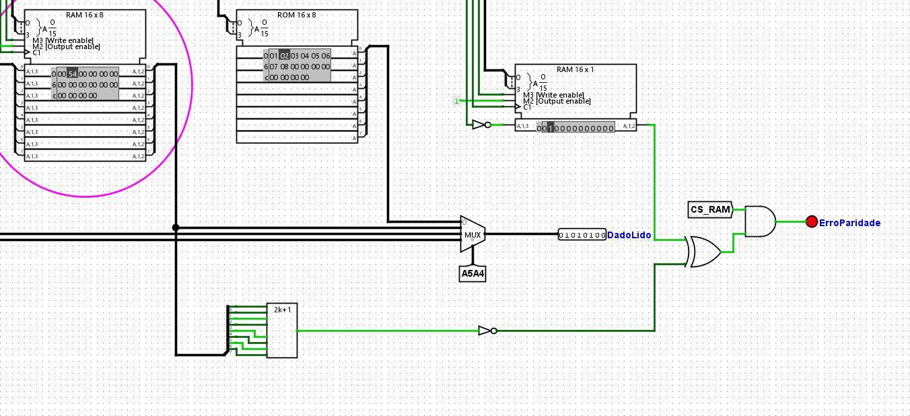

**Tabela 13 — T-03 a T-05, cache (`parte1_cache.circ`, feitos em sequência, com o LED observado antes de cada clock).**

| Teste | Entradas | Esperado | Observado | Figura |
|---|---|---|---|---|
| T-03 | Zerar; Base = 0x00, Deslocamento = 0x00 | ACERTO = 0 | endereço 00h, LED apagado | 15 |
| T-04 | Clock; Base = 0x00, Deslocamento = 0x01 | ACERTO = 1 | endereço 01h, LED aceso | 16 |
| T-05 | Clock; Base = 0x20, Deslocamento = 0x00; Clock | ACERTO = 0; rótulo da linha 0 = 100 | endereço 20h, LED apagado; Rotulo_L0 = 4h (100) | 17 e 18 |

**Figura 15 — T-03, leitura de 0x00 com a cache zerada.**

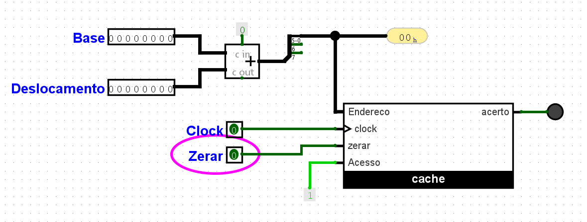

**Figura 16 — T-04, leitura de 0x01.**

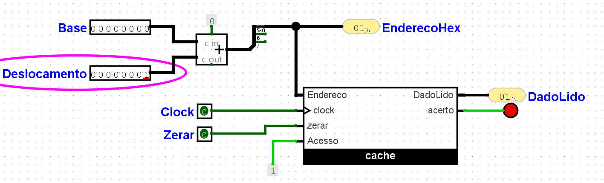

**Figura 17 — T-05, leitura de 0x20.**

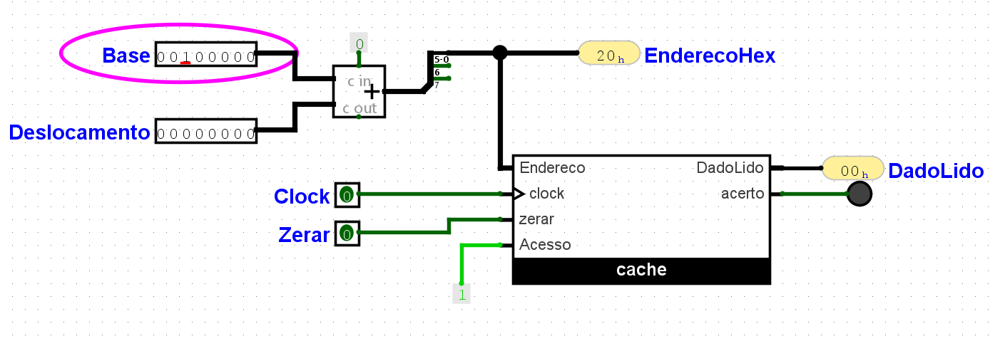

**Figura 18 — T-05, rótulo da linha 0 após o clock.**

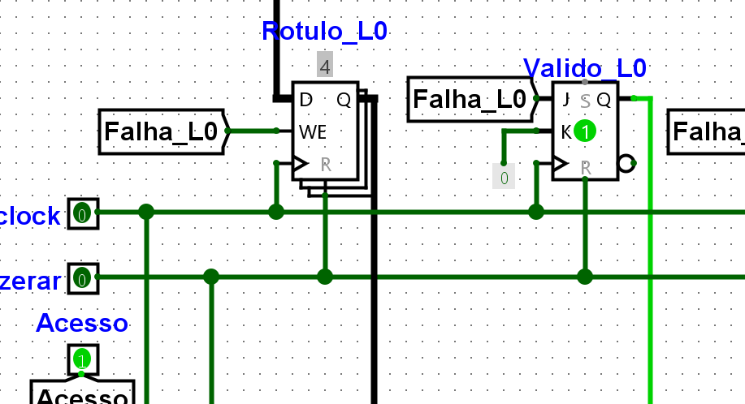

## 3. Parte II — Unidade de controle

### 3.1 Unidade de controle cabeada

A unidade de controle foi implementada como uma máquina de estados finitos de cinco estados (S0 a S4), codificados em três flip-flops D (Q2, Q1, Q0). O reset é assíncrono e leva a máquina ao estado S0. Como o caminho de dados não foi montado, o decodificador de opcode foi abstraído em uma única entrada, chamada BEQ: vale 1 quando a instrução é beq e 0 quando é do tipo R.

**Tabela 14 — Estados da unidade de controle.**

| Estado | Código (Q2Q1Q0) | Nome | O que acontece |
|---|---|---|---|
| S0 | 000 | Busca | IR ← Mem[PC]; PC ← PC + 4 |
| S1 | 001 | Decodificação | A ← Reg[rs]; B ← Reg[rt]; ULAOut ← PC + (ext(imm) << 2) |
| S2 | 010 | Execução tipo-R | ULAOut ← A op B |
| S3 | 011 | Conclusão tipo-R | Reg[rd] ← ULAOut |
| S4 | 100 | Conclusão de desvio | A − B; se Zero, PC ← ULAOut |

As transições entre os estados são as seguintes: S0 sempre vai para S1; em S1, o opcode decide o caminho, e uma instrução tipo-R (BEQ = 0) vai para S2, enquanto uma instrução beq (BEQ = 1) vai para S4; S2 vai para S3; S3 e S4 voltam para S0. O diagrama completo está na Figura 19 e a tabela de transição, com os valores que entram nos flip-flops D, está na Tabela 15.

**Tabela 15 — Tabela de transição.**

| Estado atual (Q2Q1Q0) | BEQ | Estado seguinte | D2 D1 D0 |
|---|---|---|---|
| 000 (S0) | X | 001 (S1) | 0 0 1 |
| 001 (S1) | 0 | 010 (S2) | 0 1 0 |
| 001 (S1) | 1 | 100 (S4) | 1 0 0 |
| 010 (S2) | X | 011 (S3) | 0 1 1 |
| 011 (S3) | X | 000 (S0) | 0 0 0 |
| 100 (S4) | X | 000 (S0) | 0 0 0 |
| 101, 110, 111 | X | indiferente | X X X |

**Figura 19 — Diagrama de estados da unidade de controle.**

#### Estados não utilizados

Com cinco estados e três flip-flops, sobram três combinações que a máquina não usa: 101, 110 e 111. Optou-se por tratá-las como condições indiferentes (X) nos mapas de Karnaugh, o que permite agrupamentos maiores e, portanto, equações com menos portas. A alternativa seria forçar o retorno ao estado de busca, o que exigiria portas extras para detectar esses três códigos.

Essa escolha só é segura se a máquina, ao cair acidentalmente em um desses códigos (por exemplo, por ruído elétrico), voltar sozinha a um estado válido. Isso é verificado ao final desta seção, com as equações finais em mãos. Na partida, o reset assíncrono já garante que a máquina comece em S0.

### 3.2 Tabela de tempo e CPI

### 3.3 Microprograma

### 3.4 Comparação entre as duas versões

### 3.5 Testes (T-06 a T-09)

## 4. Declaração de uso de IA generativa

## 5. Conclusão

## Referências
