# Relatório Técnico — AOC Laboratório de Circuitos

<!-- Rascunho-fonte. Ao finalizar, exportar para relatorio_tecnico.pdf (nome exigido pelo enunciado). -->

## 1. Introdução

## 2. Parte I — Subsistema de memória

O módulo de memória está em `parte1_memoria.circ`. A cache, o somador de endereço e o teste de conflito estão em `parte1_cache.circ`.

### 2.1 Módulo de memória (mapa de memória e tabela verdade dos CS)

O barramento de endereços tem 6 bits (A5..A0) e o de dados, 8 bits. A5 e A4 entram em um decodificador 2→4, feito com portas NOT e AND, que escolhe uma entre quatro regiões de 16 bytes. A3..A0 escolhem a posição dentro da região. O mapa de memória está na Tabela 1, e a Tabela 2 mostra que exatamente um sinal CS fica ativo em cada combinação de A5 e A4.

**Tabela 1 — Mapa de memória.**

| Faixa | Dispositivo | Tamanho | Sinal de seleção |
|---|---|---|---|
| 0x00 – 0x0F | ROM de programa | 16 bytes | CS_ROM = A5' · A4' |
| 0x10 – 0x1F | RAM de dados | 16 bytes | CS_RAM = A5' · A4 |
| 0x20 – 0x2F | Banco de registradores | 16 bytes | CS_REG = A5 · A4' |
| 0x30 – 0x3F | Região de E/S | 16 bytes | CS_IO = A5 · A4 |

**Tabela 2 — Tabela verdade dos sinais de seleção.**

| A5 | A4 | CS_ROM | CS_RAM | CS_REG | CS_IO |
|---|---|---|---|---|---|
| 0 | 0 | 1 | 0 | 0 | 0 |
| 0 | 1 | 0 | 1 | 0 | 0 |
| 1 | 0 | 0 | 0 | 1 | 0 |
| 1 | 1 | 0 | 0 | 0 | 1 |

A escrita em cada dispositivo é habilitada por `CS · Escrita`; a ROM não é gravável. As saídas dos quatro dispositivos são reunidas pelo multiplexador de 4 entradas (Componente 02), comandado por A5 e A4, cuja saída é o pino `DadoLido`. A ROM (Componente 05) e as RAMs de dados e de E/S (Componente 06) são memórias 16 × 8 da biblioteca, endereçadas por A3..A0. O banco de registradores (Componente 07) tem 16 registradores de 8 bits, um decodificador 4→16 para a escrita e um multiplexador de 16 entradas para a leitura. Os pinos estão nas Tabelas 3 a 5, e os circuitos, nas Figuras 1 e 2. As memórias e o multiplexador de saída aparecem nas Figuras 13 a 15.

**Tabela 3 — Pinos do módulo de memória (`main` de `parte1_memoria.circ`).**

| Pino | Direção | Bits | Função |
|---|---|---|---|
| Endereco | entrada | 6 | Endereço A5..A0 |
| DataEscrita | entrada | 8 | Dado a gravar |
| Escrita | entrada | 1 | Habilita a escrita no dispositivo selecionado |
| CLOCK | entrada | 1 | Relógio de escrita |
| DadoLido | saída | 8 | Saída do multiplexador |
| CS_ROM, CS_RAM, CS_REG, CS_IO | LED | 1 cada | Região selecionada |
| ErroParidade | LED | 1 | Erro de paridade na leitura da RAM |

**Tabela 4 — Pinos do subcircuito `Decodificador`.**

| Pino | Direção | Bits | Função |
|---|---|---|---|
| A5, A4 | entrada | 1 cada | Bits mais significativos do endereço |
| CS_ROM, CS_RAM, CS_REG, CS_IO | saída | 1 cada | Equações da Tabela 1 |

**Tabela 5 — Pinos do subcircuito `BancoDeRegistradores`.**

| Pino | Direção | Bits | Função |
|---|---|---|---|
| RegWrite | entrada | 1 | CS_REG · Escrita |
| Endereco | entrada | 4 | A3..A0 |
| DadoEscrita | entrada | 8 | Dado a gravar |
| Clock | entrada | 1 | Relógio |
| DadoLido | saída | 8 | Registrador endereçado |

**Figura 1 — Circuito do decodificador de endereços.**

**Figura 2 — Circuito do banco de registradores.**

### 2.2 Bit de paridade

Cada palavra gravada na RAM recebe um bit de paridade ímpar, guardado numa RAM separada de 16 posições de 1 bit. O detector de paridade ímpar (Componente 14) é a porta *Odd Parity* de 8 entradas, e o bit gravado é `p = NOT(OddParity(dado))`. Na leitura, o bit é recalculado e comparado com o guardado por uma XOR: `ErroParidade = (p_guardado XOR p_recalculado) · CS_RAM`. O funcionamento é mostrado no teste T-02 (Tabela 13).

### 2.3 Cache (divisão do endereço e comparador de rótulos)

A cache tem mapeamento direto, 4 linhas e blocos de 2 bytes, e atende somente leituras. O endereço se divide em três campos (Tabela 6):

- deslocamento = log₂(tamanho do bloco) = log₂(2) = 1 bit → A0;
- índice = log₂(número de linhas) = log₂(4) = 2 bits → A2 A1;
- rótulo = 6 − 2 − 1 = 3 bits → A5 A4 A3.

**Tabela 6 — Divisão do endereço.**

| Campo | Bits | Largura |
|---|---|---|
| Rótulo | A5 A4 A3 | 3 |
| Índice | A2 A1 | 2 |
| Deslocamento | A0 | 1 |

Exemplo: 0x22 = 100010, com deslocamento 0, índice 01 e rótulo 100. Esse endereço só pode ocupar a linha 1, onde será registrado o rótulo 100.

O endereço é calculado pelo somador de 8 bits (Componente 08) como `Base + Deslocamento`. O somador tem a largura da palavra do sistema (8 bits), e só os bits 5..0 da soma são usados como endereço.

Cada linha tem um registrador de rótulo de 3 bits e um bit de validade feito com flip-flop JK (Componente 01), com J = falta da linha e K = 0. O pino `zerar` aciona o reset dos registradores e dos flip-flops, invalidando a cache (Figura 4). O sinal de falta de cada linha é `Falha_Lx = decodificador[x] · NOT(Acerto) · Acesso`, e ele habilita a escrita do rótulo na borda do clock. O pino `Acesso` indica se a borda do clock é um acesso de leitura: no `main` ele vale 1, e no teste da Seção 2.5 ele recebe a saída do detector de primos.

O comparador de rótulos usa três XOR feitas com AND, OR e NOT (Componente 03), sem comparador da biblioteca (Figura 3):

`iguais = NOT( (T2 XOR S2) OR (T1 XOR S1) OR (T0 XOR S0) )`

`ACERTO = iguais · valido[índice]`

Um contador de 4 bits, habilitado por `Acerto · Acesso`, conta os acertos e alimenta o decodificador de 7 segmentos (Componente 16), que mostra o valor no display (Figura 6). Os pinos estão na Tabela 7.

O arranjo de dados (Componente 06) é o subcircuito `Arranjo_dados`, que guarda os 8 bytes da cache em duas RAMs 4 × 8: `Dados_byte0` guarda o byte de deslocamento 0 de cada linha e `Dados_byte1`, o de deslocamento 1. As duas são endereçadas pelo índice e gravadas quando há falta em qualquer linha (OR de `Falha_L0` a `Falha_L3`), de modo que o bloco inteiro é copiado em um único ciclo. Um multiplexador 2:1 comandado por A0 entrega o byte pedido no pino `DadoLido`. Num acerto o dado aparece antes da borda do clock; numa falta, só depois dela, quando o bloco é copiado. Os pinos estão na Tabela 8 e o circuito, na Figura 5.

As duas ROMs 32 × 8 dentro do `Arranjo_dados` (`ROM_byte0` e `ROM_byte1`) representam a memória principal, isto é, o nível abaixo da cache, de onde o bloco é copiado numa falta. Elas não são o módulo de memória da Seção 2.1, e sim um modelo simplificado dele, usado por dois motivos: o módulo está em outro arquivo (`parte1_memoria.circ`) e lê um byte por vez, enquanto a cache precisa receber os dois bytes do bloco no mesmo ciclo. Por isso a memória foi organizada em blocos: as duas ROMs são endereçadas pelo número do bloco (A5..A1), e a `ROM_byte0` guarda os bytes de endereço par e a `ROM_byte1`, os de endereço ímpar. O conteúdo de cada posição é o próprio endereço (a posição 0x21 guarda 0x21), o que permite conferir nos testes se o dado entregue pela cache corresponde ao endereço pedido.

**Tabela 7 — Pinos do `main` e do subcircuito `cache` (`parte1_cache.circ`).**

| Pino | Onde | Direção | Bits | Função |
|---|---|---|---|---|
| Base | main | entrada | 8 | Operando do somador |
| Deslocamento | main | entrada | 8 | Operando do somador |
| Clock | main | entrada | 1 | Conclui o acesso na borda de subida |
| Zerar | main | entrada | 1 | Invalida a cache e zera o contador |
| Endereco | cache | entrada | 6 | Bits 5..0 da soma |
| Acesso | cache | entrada | 1 | 1 = a borda do clock é um acesso |
| acerto | cache | saída | 1 | 1 = acerto |
| DadoLido | cache | saída | 8 | Byte lido do arranjo de dados |

**Figura 3 — Comparador de rótulos com XOR sintetizado.**

**Figura 4 — Cache logo após o `zerar`: bits de validade em 0.**

**Tabela 8 — Pinos do subcircuito `Arranjo_dados`.**

| Pino | Direção | Bits | Função |
|---|---|---|---|
| Bloco | entrada | 5 | A5..A1: endereço do bloco nas ROMs |
| Indice | entrada | 2 | Linha da cache (endereço das RAMs) |
| A0 | entrada | 1 | Byte dentro do bloco (seletor do multiplexador) |
| Clock | entrada | 1 | Relógio das RAMs |
| Falha_L0 a Falha_L3 | entrada | 1 cada | Habilitam a gravação do bloco |
| DadoLido | saída | 8 | Byte pedido |

**Figura 5 — Arranjo de dados: ROMs da memória principal, RAMs `Dados_byte0` e `Dados_byte1` e multiplexador de saída.**

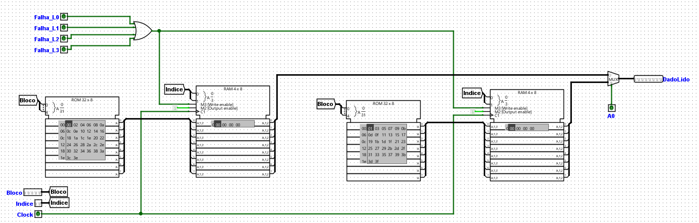

### 2.4 Planilha e indicadores

A planilha `parte1_planilha.xlsx` traz os 16 acessos do traço, com as colunas derivadas por fórmula. Os indicadores estão na Tabela 9. O circuito confirma o resultado: ao final do traço, o display mostra 8 acertos (Figura 6).

**Tabela 9 — Indicadores do traço.**

| Indicador | Expressão | Valor |
|---|---|---|
| Acertos | contagem de ACERTO | 8 |
| Faltas | contagem de FALTA | 8 |
| Taxa de acertos | 8 ÷ 16 | 50% |
| Faltas compulsórias | contagem de "compulsoria" | 4 |
| Faltas por conflito | contagem de "conflito" | 4 |
| AMAT | tempo de acerto + taxa de faltas × penalidade = 1 + 0,5 × 8 | 5 ciclos |

**Figura 6 — Display de sete segmentos após os 16 acessos do traço (8 acertos).**

### 2.5 Teste de conflito (detector de primos)

Um contador síncrono de 3 bits percorre v = 0 a 7. O detector de primos de 4 bits (Componente 17) recebe A = 0 e B, C, D = v, e sua saída vai ao pino `Acesso` da cache, de modo que só os valores primos geram acesso. O endereço é `v << 3`. Minimizando pelo mapa de Karnaugh (primos 2, 3, 5, 7, 11 e 13), a equação do detector é:

`P = A'B'C + A'BD + B'CD + BC'D`

Os pinos do detector estão na Tabela 10, o circuito na Figura 7, o resultado do teste na Tabela 11 e o estado final na Figura 8.

**Tabela 10 — Pinos do subcircuito `DetectorPrimos`.**

| Pino | Direção | Bits | Função |
|---|---|---|---|
| A, B, C, D | entrada | 1 cada | Número de 4 bits (A é o mais significativo) |
| Primo | saída | 1 | 1 se o número é primo |

**Figura 7 — Circuito do detector de primos.**

**Tabela 11 — Teste de conflito, começando com a cache invalidada.**

| v | Endereço | Binário | Rótulo | Índice | Resultado |
|---|---|---|---|---|---|
| 2 | 0x10 | 010000 | 010 | 00 | FALTA (compulsória) |
| 3 | 0x18 | 011000 | 011 | 00 | FALTA (conflito) |
| 5 | 0x28 | 101000 | 101 | 00 | FALTA (conflito) |
| 7 | 0x38 | 111000 | 111 | 00 | FALTA (conflito) |

**Figura 8 — Contador de acertos e display da instância da cache usada no `ConflitoPrimos`, após os oito clocks do teste (0 acertos).**

**Por que a regra produz esse resultado.** Deslocar v três posições à esquerda coloca v em A5A4A3, que é o rótulo, e zera A2A1A0. Assim, o índice (A2A1) é sempre 00: os quatro endereços disputam a linha 0 com rótulos diferentes, cada um expulsa o anterior, e não há nenhum acerto, mesmo com três linhas ociosas.

**Com oito linhas.** O índice passaria a ter 3 bits (A3A2A1) e o rótulo, 2 bits. Como A3 = v0 e A2A1 = 00, o índice seria 000 para v = 2 e 100 para v = 3, 5 e 7. O endereço 0x10 ficaria sozinho na linha 0, mas 0x18, 0x28 e 0x38 continuariam disputando a linha 4. Dobrar as linhas não elimina o conflito, porque a regra `v << 3` só faz variar um bit do índice.

### 2.6 Testes (T-01 a T-05)

As Tabelas 12 a 14 registram as entradas, as saídas esperadas e as observadas em cada teste. As capturas de tela estão nas Figuras 9 a 20.

**Tabela 12 — T-01, seleção de região (`parte1_memoria.circ`).**

| Endereco | A5A4 | Esperado | Observado | Figura |
|---|---|---|---|---|
| 0x00 | 00 | só CS_ROM ativo | só CS_ROM aceso | Figura 9 |
| 0x10 | 01 | só CS_RAM ativo | só CS_RAM aceso | Figura 10 |
| 0x20 | 10 | só CS_REG ativo | só CS_REG aceso | Figura 11 |
| 0x30 | 11 | só CS_IO ativo | só CS_IO aceso | Figura 12 |

**Figura 9 — T-01, A5A4 = 00.**

**Figura 10 — T-01, A5A4 = 01.**

**Figura 11 — T-01, A5A4 = 10.**

**Figura 12 — T-01, A5A4 = 11.**

**Tabela 13 — T-02, erro de paridade (`parte1_memoria.circ`).**

| Passo | Entradas | Esperado | Observado | Figura |
|---|---|---|---|---|
| Gravar | Endereco = 0x11, DataEscrita = 0x55, Escrita = 1, pulso em CLOCK | RAM[1] = 0x55, paridade = 1 | RAM[1] = 55, paridade[1] = 1 | Figura 13 |
| Ler | Endereco = 0x11, Escrita = 0 | DadoLido = 0x55, sem erro | DadoLido = 01010101, LED apagado | Figura 14 |
| Inverter um bit e ler | RAM[1] editada para 0x54 | DadoLido = 0x54, erro aceso | DadoLido = 01010100, LED aceso | Figura 15 |

**Figura 13 — T-02, gravação de 0x55 em 0x11.**

**Figura 14 — T-02, leitura de 0x55 sem erro.**

**Figura 15 — T-02, leitura de 0x54 com erro de paridade.**

**Tabela 14 — T-03 a T-05 e dado entregue pela cache (`parte1_cache.circ`, feitos em sequência, com as saídas observadas antes de cada clock).**

| Teste | Entradas | Esperado | Observado | Figura |
|---|---|---|---|---|
| T-03 | Zerar; Base = 0x00, Deslocamento = 0x00 | ACERTO = 0 | endereço 00h, LED apagado | Figura 16 |
| T-04 | Clock; Base = 0x00, Deslocamento = 0x01 | ACERTO = 1; DadoLido = 0x01 | endereço 01h, LED aceso, DadoLido 01h | Figura 17 |
| T-05 | Clock; Base = 0x20, Deslocamento = 0x00; Clock | ACERTO = 0; rótulo da linha 0 = 100 | endereço 20h, LED apagado; Rotulo_L0 = 4h (100) | Figuras 18 e 19 |
| Dado no acerto | Base = 0x20, Deslocamento = 0x01 | ACERTO = 1; DadoLido = 0x21 | endereço 21h, LED aceso, DadoLido 21h | Figura 20 |

**Figura 16 — T-03, leitura de 0x00 com a cache zerada.**

**Figura 17 — T-04, leitura de 0x01.**

**Figura 18 — T-05, leitura de 0x20.**

**Figura 19 — T-05, rótulo da linha 0 após o clock.**

**Figura 20 — Leitura de 0x21 após a falta em 0x20: acerto, com o dado 21 entregue pelo arranjo de dados.**

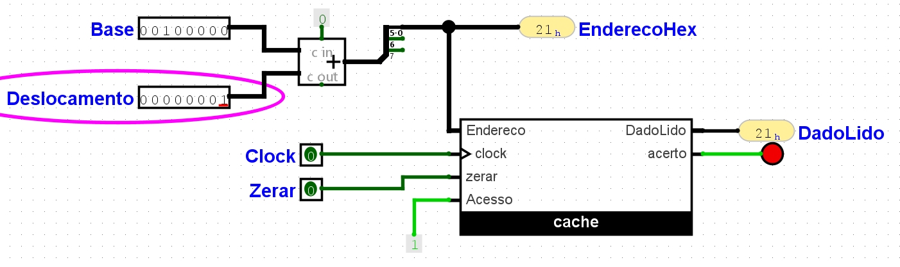

## 3. Parte II — Unidade de controle

### 3.1 Unidade de controle cabeada

A unidade de controle foi implementada como uma máquina de estados finitos de cinco estados (S0 a S4), codificados em três flip-flops D (Q2, Q1, Q0). O reset é assíncrono e leva a máquina ao estado S0. Como o caminho de dados não foi montado, o decodificador de opcode foi abstraído em uma única entrada, chamada BEQ: vale 1 quando a instrução é beq e 0 quando é do tipo R.

**Tabela 15 — Estados da unidade de controle.**

| Estado | Código (Q2Q1Q0) | Nome | O que acontece |
|---|---|---|---|
| S0 | 000 | Busca | IR ← Mem[PC]; PC ← PC + 4 |
| S1 | 001 | Decodificação | A ← Reg[rs]; B ← Reg[rt]; ULAOut ← PC + (ext(imm) << 2) |
| S2 | 010 | Execução tipo-R | ULAOut ← A op B |
| S3 | 011 | Conclusão tipo-R | Reg[rd] ← ULAOut |
| S4 | 100 | Conclusão de desvio | A − B; se Zero, PC ← ULAOut |

As transições entre os estados são as seguintes: S0 sempre vai para S1; em S1, o opcode decide o caminho, e uma instrução tipo-R (BEQ = 0) vai para S2, enquanto uma instrução beq (BEQ = 1) vai para S4; S2 vai para S3; S3 e S4 voltam para S0. O diagrama completo está na Figura 21 e a tabela de transição, com os valores que entram nos flip-flops D, está na Tabela 16.

**Tabela 16 — Tabela de transição.**

| Estado atual (Q2Q1Q0) | BEQ | Estado seguinte | D2 D1 D0 |
|---|---|---|---|
| 000 (S0) | X | 001 (S1) | 0 0 1 |
| 001 (S1) | 0 | 010 (S2) | 0 1 0 |
| 001 (S1) | 1 | 100 (S4) | 1 0 0 |
| 010 (S2) | X | 011 (S3) | 0 1 1 |
| 011 (S3) | X | 000 (S0) | 0 0 0 |
| 100 (S4) | X | 000 (S0) | 0 0 0 |
| 101, 110, 111 | X | indiferente | X X X |

**Figura 21 — Diagrama de estados da unidade de controle.**

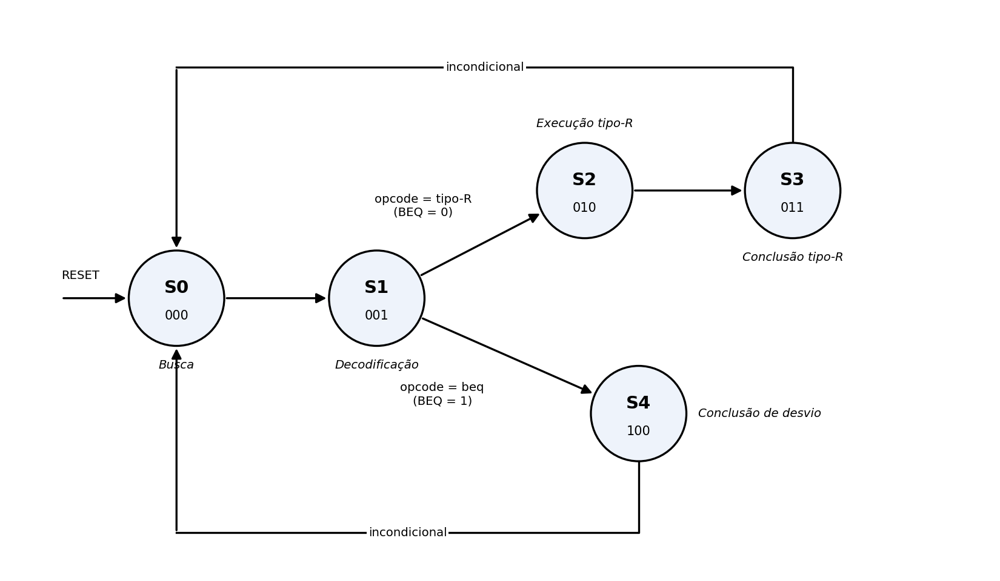

#### Estados não utilizados

Com cinco estados e três flip-flops, sobram três combinações que a máquina não usa: 101, 110 e 111. Optou-se por tratá-las como condições indiferentes (X) nos mapas de Karnaugh, o que permite agrupamentos maiores e, portanto, equações com menos portas. A alternativa seria forçar o retorno ao estado de busca, o que exigiria portas extras para detectar esses três códigos.

Essa escolha só é segura se a máquina, ao cair acidentalmente em um desses códigos (por exemplo, por ruído elétrico), voltar sozinha a um estado válido. Isso é verificado ao final desta seção, com as equações finais em mãos. Na partida, o reset assíncrono já garante que a máquina comece em S0.

### 3.2 Tabela de tempo e CPI

### 3.3 Microprograma

A segunda implementação gera os mesmos sinais de controle, mas guarda-os em uma memória em vez de calculá-los com portas. O sequenciamento fica a cargo de um microcontador de programa (µPC) de 3 bits, e os sinais ficam em uma ROM de 8 posições por 8 bits (Componente 05). O µPC (Componente 13) foi feito com um registrador de 3 flip-flops D (Componente 01) e um somador de +1, que juntos fazem o papel do contador síncrono. O estado atual (o valor do µPC) aparece em um display de sete segmentos (Componente 16). O circuito está em `parte2_microprogramada.circ`. Como na versão cabeada, o caminho de dados não foi montado: as saídas de controle são observadas em pinos de saída, e o opcode foi abstraído no pino `OP_BEQ` (equivalente ao `BEQ` da Seção 3.1), que vale 1 para beq e 0 para tipo-R.

#### Formato da microinstrução

A microinstrução tem 8 bits, divididos em quatro campos de 2 bits (Tabela 17). O campo Fonte com valor 00 implica, além de selecionar o PC e a constante 4 como entradas da ULA, a escrita incondicional do PC, por isso a microinstrução de busca não precisa de um campo próprio para o controle do PC.

**Tabela 17 — Formato da microinstrução de 8 bits.**

| Campo | Bits | Codificação |
|---|---|---|
| ULAOp | 7–6 | 00 = soma; 01 = subtração; 10 = operação dada pelo campo funct; 11 = reservado |
| Fonte | 5–4 | 00 = PC e constante 4; 01 = registrador A e registrador B; 10 = PC e extensão de sinal deslocada de 2; 11 = reservado |
| Ação | 3–2 | 00 = nenhuma; 01 = IR ← Mem[PC]; 10 = Reg[rd] ← ULAOut; 11 = PC ← ULAOut se Zero |
| Seq | 1–0 | 00 = próxima microinstrução; 01 = volta à busca; 10 = despacho pelo opcode; 11 = reservado |

#### Microprograma

A Tabela 18 traz o microprograma completo. O conteúdo da ROM, carregado em `microcodigo.txt`, é `04 22 90 19 5d 00 00 00`; as posições 5, 6 e 7 ficam livres. Em ConclR, o campo ULAOp (00) é indiferente: Reg[rd] recebe o ULAOut já calculado em ExecR, e a saída da ULA não é usada nesse estado. Em ExecR, Fonte = 01 seleciona os registradores A e B, e ULAOp = 10 deixa a operação a cargo do campo funct.

**Tabela 18 — Microprograma.**

| Rótulo | Endereço | ULAOp | Fonte | Ação | Seq | Binário | Hexadecimal |
|---|---|---|---|---|---|---|---|
| Busca | 0 | 00 | 00 | 01 | 00 | 00000100 | 0x04 |
| Decod | 1 | 00 | 10 | 00 | 10 | 00100010 | 0x22 |
| ExecR | 2 | 10 | 01 | 00 | 00 | 10010000 | 0x90 |
| ConclR | 3 | 00 | 01 | 10 | 01 | 00011001 | 0x19 |
| ConclBEQ | 4 | 01 | 01 | 11 | 01 | 01011101 | 0x5D |

Os códigos 101, 110 e 111 do µPC nunca são alcançados: o µPC só recebe µPC + 1 (dentro da faixa de 0 a 4), 0, 2 ou 4, e as posições 5 a 7 da ROM contêm 00.

#### Circuito

O µPC (registrador `upc`) endereça a ROM de microcódigo, e os oito bits lidos são divididos nos quatro campos. O campo Seq comanda o multiplexador de 4 entradas (Componente 02) que escolhe o próximo endereço, entregue ao registrador pelo rótulo `PROX`: com Seq = 00 o µPC recebe µPC + 1; com Seq = 01, recebe 0 (volta à busca); com Seq = 10 (despacho pelo opcode), recebe a saída de um segundo multiplexador, que escolhe entre o endereço 2 (tipo-R, `OP_BEQ` = 0) e o endereço 4 (beq, `OP_BEQ` = 1); Seq = 11 é reservado e leva a 0. O circuito está na Figura 22 e os pinos e elementos, na Tabela 19.

**Figura 22 — Circuito principal da unidade microprogramada: µPC, somador, ROM de microcódigo, multiplexadores e display.**

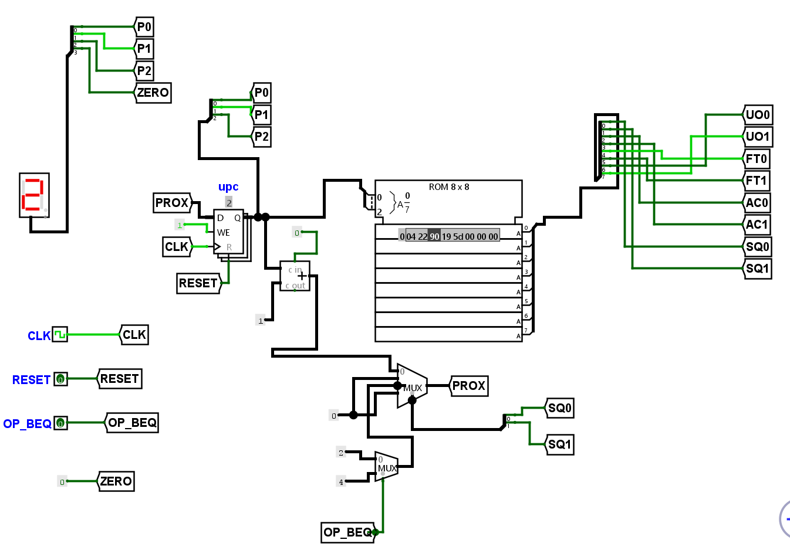

**Tabela 19 — Elementos e pinos da versão microprogramada (`parte2_microprogramada.circ`).**

| Elemento | Componente | Pinos e função |
|---|---|---|
| upc | Registrador de 3 flip-flops D (Componente 01), usado como µPC (Componente 13) | D (3 bits) recebe `PROX`; Q (3 bits) é o µPC; CLK; WE fixo em 1; R (reset) ligado a `RESET` |
| Somador +1 | Somador de 3 bits | Entradas: µPC e constante 1; a saída (µPC + 1) é a entrada 0 do multiplexador de próximo endereço |
| ROM 8×8 | ROM (Componente 05) | Endereço A de 3 bits = µPC; saída de 8 bits dividida em UO1UO0 (ULAOp), FT1FT0 (Fonte), AC1AC0 (Ação) e SQ1SQ0 (Seq) |
| MUX de próximo endereço | Multiplexador de 4 entradas (Componente 02) | Seleção = SQ1SQ0. 00 → µPC + 1; 01 → 0; 10 → saída do MUX de despacho; 11 → 0. Saída = `PROX` |
| MUX de despacho | Multiplexador de 2 entradas | Seleção = `OP_BEQ`. 0 → constante 2 (ExecR); 1 → constante 4 (ConclBEQ) |
| Display | Decodificador de 7 segmentos (Componente 16) | Mostra o µPC; o 4º bit vai a uma constante 0 (rótulo `GND`), independente do `ZERO` |
| CLK | Pino de entrada, 1 bit | Relógio do µPC |
| RESET | Pino de entrada, 1 bit | Zera o µPC (estado S0) |
| OP_BEQ | Pino de entrada, 1 bit | 0 = tipo-R; 1 = beq (decide o despacho em S1) |
| ZERO | Pino de entrada, 1 bit | Simula o sinal Zero da ULA, pois o caminho de dados não está montado |
| Saídas de controle | Pinos de saída | PCWrite, PCWriteCond, PCSource, MemRead, IRWrite, RegWrite, ALUSrcA, ALUSrcB1, ALUSrcB0, ALUOp1, ALUOp0 e uPC_2..uPC_0 |

#### Decodificação dos campos em sinais de controle

Os campos lidos da ROM são convertidos nos nove sinais de controle por portas AND e NOT (Figura 23). As equações estão na Tabela 20. Os campos ULAOp e ALUSrcB1 passam direto: ULAOp vai para ALUOp1 e ALUOp0, e FT1 é o próprio ALUSrcB1.

**Figura 23 — Portas de decodificação dos campos da microinstrução.**

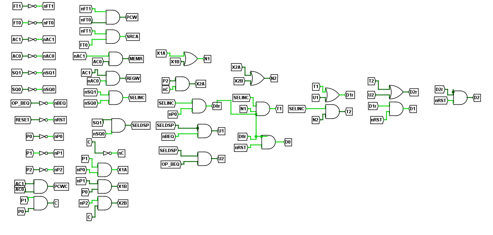

**Tabela 20 — Decodificação dos campos (FT = Fonte, AC = Ação, UO = ULAOp).**

| Sinal | Equação | Campo |
|---|---|---|
| PCWrite e ALUSrcB0 | FT1' · FT0' | Fonte = 00 |
| ALUSrcA | FT1' · FT0 | Fonte = 01 |
| ALUSrcB1 | FT1 | Fonte = 10 |
| MemRead e IRWrite | AC1' · AC0 | Ação = 01 |
| RegWrite | AC1 · AC0' | Ação = 10 |
| PCWriteCond e PCSource | AC1 · AC0 | Ação = 11 |
| ALUOp1, ALUOp0 | UO1, UO0 (direto) | ULAOp |

<!-- CONFIRMAR: o esquema de portas da Figura 23 também calcula D2 D1 D0 (próximo µPC). Indicar se ele alimenta o registrador ou se PROX vem do somador com multiplexador (Figura 22). Na Figura 22, o registrador recebe PROX. -->

### 3.4 Comparação entre as duas versões

### 3.5 Testes (T-06 a T-09)

#### Versão microprogramada

Os testes T-06 a T-08 foram executados na versão microprogramada, com a simulação habilitada, o pulso automático desligado e um ciclo completo de relógio por estado. Os pinos `RESET`, `OP_BEQ` e `ZERO` foram acionados com a ferramenta de interação, e o display de sete segmentos mostra o estado atual. As Tabelas 21 a 23 registram as entradas, as saídas esperadas e as observadas, e as capturas estão nas Figuras 24 a 34.

**Tabela 21 — T-06, ciclo de busca (`parte2_microprogramada.circ`).**

| Momento | Entradas | Esperado | Observado | Figura |
|---|---|---|---|---|
| Após o reset | RESET = 1, OP_BEQ = 0 | estado S0; PCWrite, MemRead, IRWrite e ALUSrcB0 em 1 | display 0; os quatro sinais em 1 | 24 |
| Um ciclo depois | RESET = 0 | estado S1; IRWrite volta a 0; ALUSrcB1 em 1 | display 1; IRWrite = 0; ALUSrcB1 = 1 | 25 |

**Figura 24 — T-06, estado S0: sequenciador (RESET = 1) e saídas.**

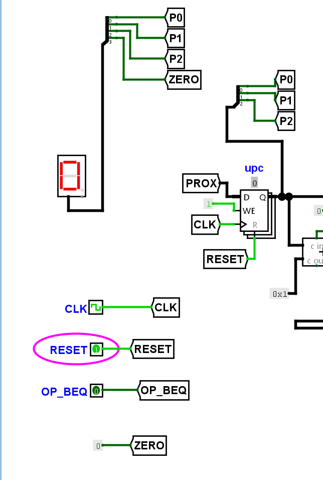

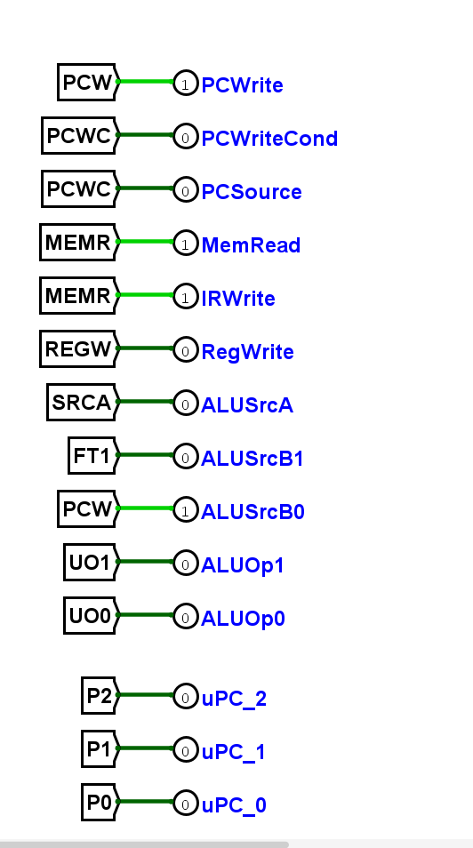

**Figura 25 — T-06, estado S1: sequenciador e saídas.**

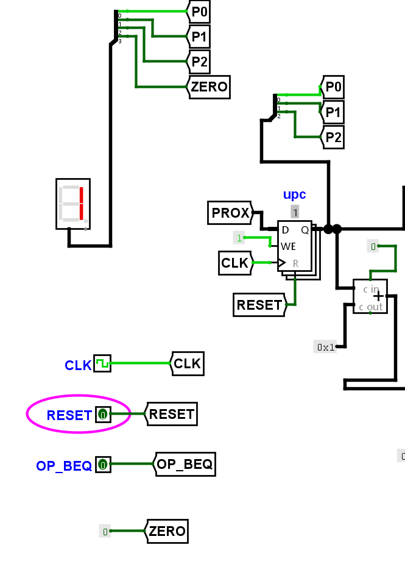

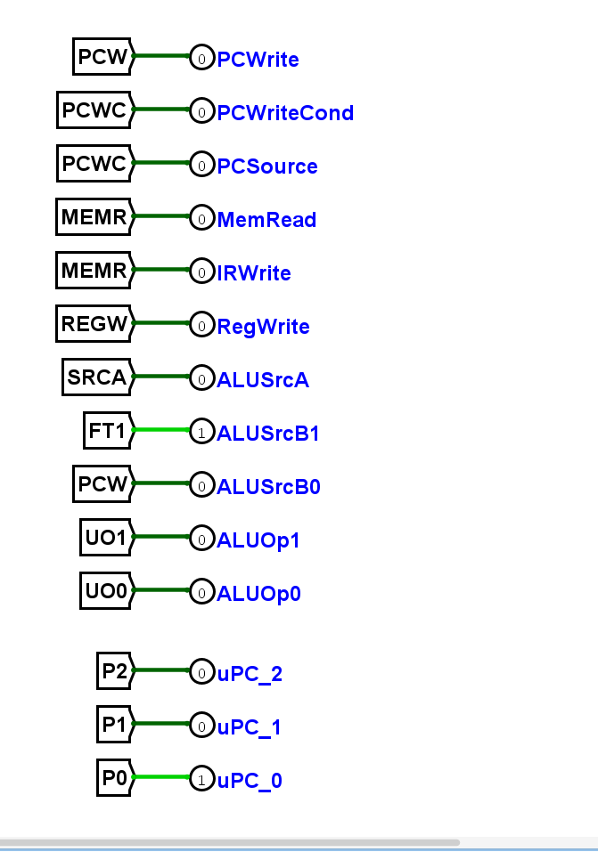

**Tabela 22 — T-07, instrução tipo-R (`OP_BEQ` = 0, quatro ciclos).**

| Estado | Display | Esperado (sinais em 1) | Observado | Figura |
|---|---|---|---|---|
| S0 | 0 | PCWrite, MemRead, IRWrite, ALUSrcB0 | igual ao esperado | 26 |
| S1 | 1 | ALUSrcB1 | igual ao esperado | 27 |
| S2 | 2 | ALUSrcA, ALUOp1 | igual ao esperado | 28 |
| S3 | 3 | RegWrite, ALUSrcA | igual ao esperado | 29 |
| volta | 0 | PCWrite, MemRead, IRWrite, ALUSrcB0 | igual ao esperado | 30 |

Como o caminho de dados não foi montado, o registro do resultado em `rd` é demonstrado pelo sinal RegWrite = 1 em S3.

**Figura 26 — T-07, estado S0.**

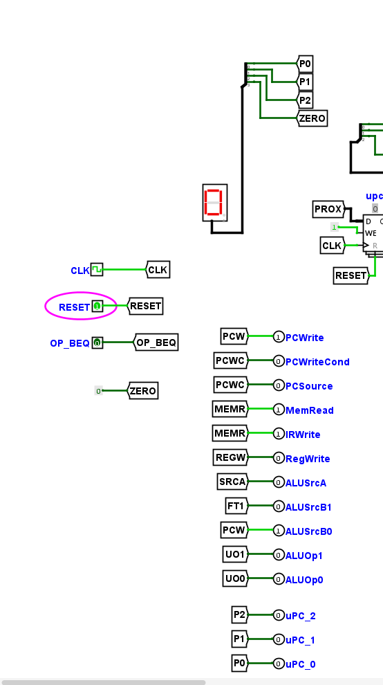

**Figura 27 — T-07, estado S1.**

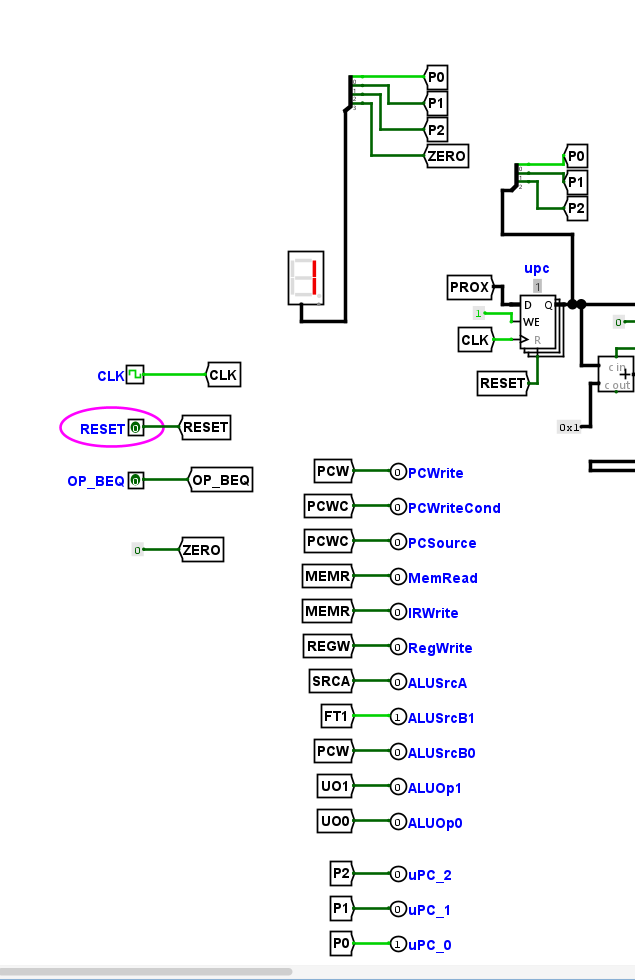

**Figura 28 — T-07, estado S2.**

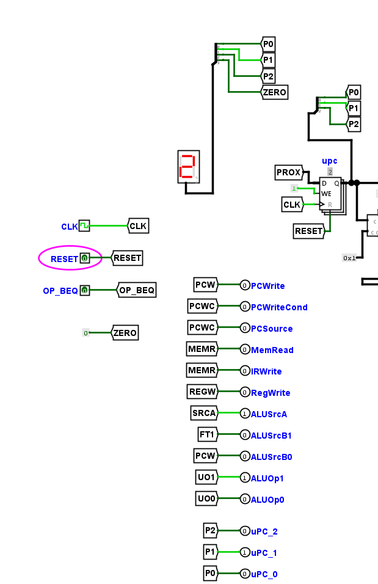

**Figura 29 — T-07, estado S3 (RegWrite = 1).**

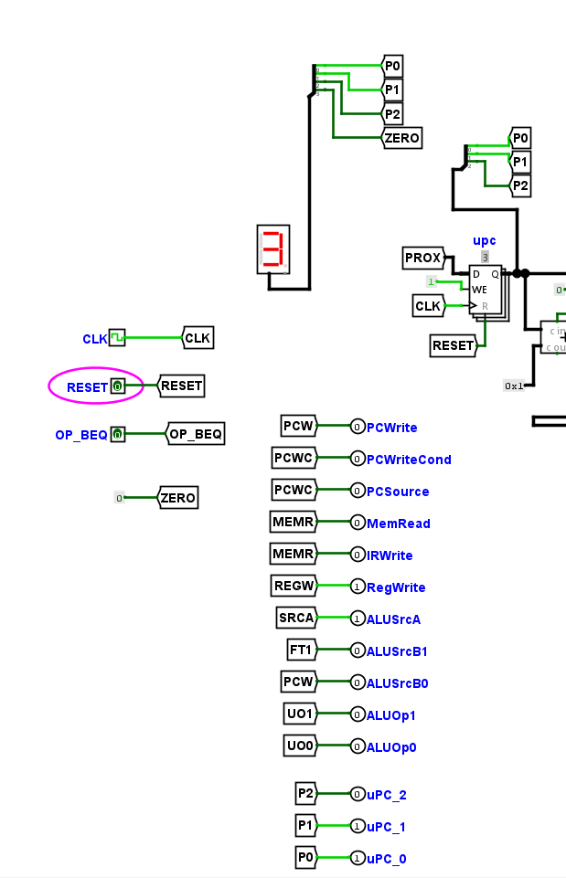

**Figura 30 — T-07, retorno ao estado S0.**

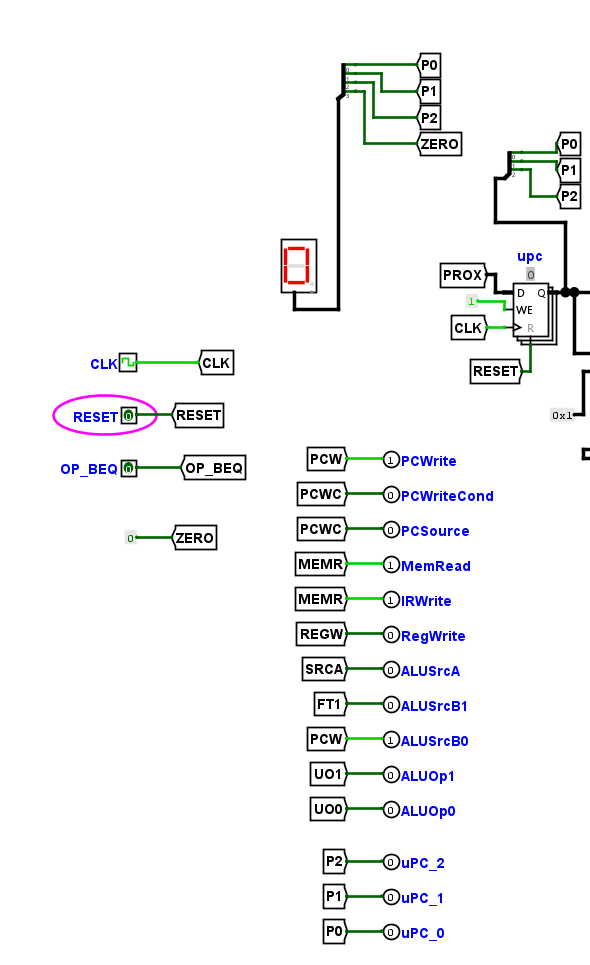

**Tabela 23 — T-08, desvio tomado e não tomado (`OP_BEQ` = 1).**

| Caso | ZERO | Estado | Sinais em 1 (observados) | Efeito no PC | Figura |
|---|---|---|---|---|---|
| Tomado | 1 | S4 (display 4) | PCWriteCond, PCSource, ALUSrcA, ALUOp0 | PC ← ULAOut | 33 |
| Não tomado | 0 | S4 (display 4) | PCWriteCond, PCSource, ALUSrcA, ALUOp0 | PC não muda | 34 |

Os sinais de saída são os mesmos nos dois casos, porque dependem apenas do estado. A diferença está no pino `ZERO`: o PC só é gravado quando PCWriteCond · ZERO = 1. Como o caminho de dados não foi montado, o `ZERO` foi simulado por um pino de entrada. O caminho S0 → S1 → S4 → S0 está nas Figuras 31 e 32.

**Figura 31 — T-08, estado S4 (caminho S0 → S1 → S4).**

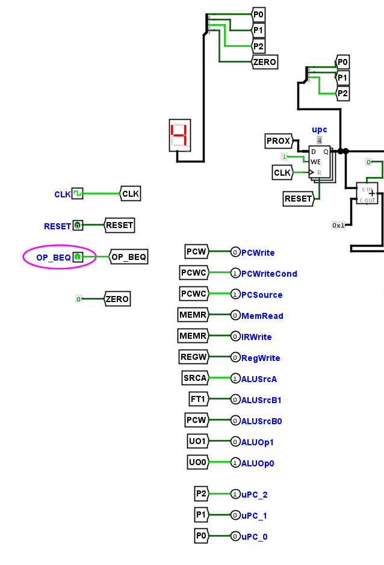

**Figura 32 — T-08, retorno ao estado S0.**

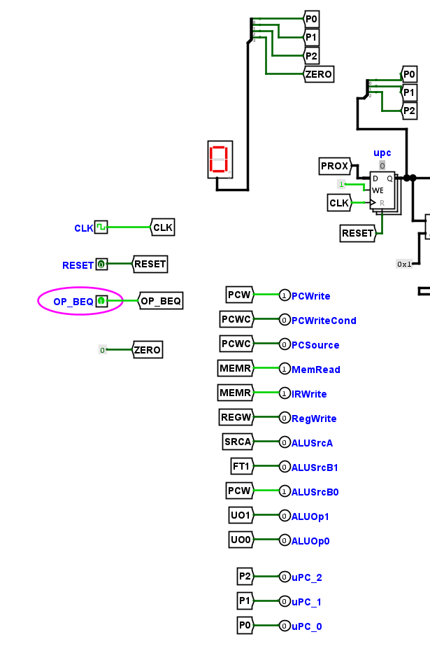

**Figura 33 — T-08, estado S4 com ZERO = 1 (desvio tomado).**

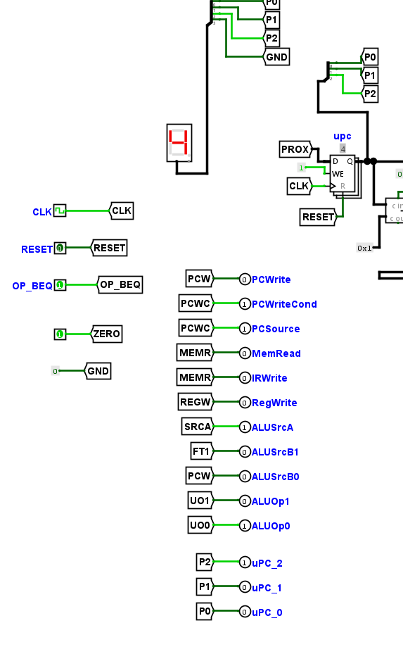

**Figura 34 — T-08, estado S4 com ZERO = 0 (desvio não tomado).**

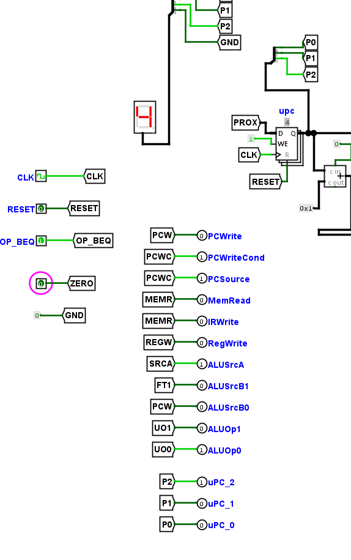

#### T-09 — lado microprogramado

A Tabela 24 registra os sinais da versão microprogramada em cada estado (`OP_BEQ` = 0 de S0 a S3 e `OP_BEQ` = 1 em S4), para serem confrontados com os da versão cabeada. As capturas são as das Figuras 26 a 29 e 31, também salvas como `T09_micro_S0.png` a `T09_micro_S4.png`.

**Tabela 24 — Sinais de controle por estado na versão microprogramada.**

| Estado | PCWrite | PCWriteCond | PCSource | MemRead | IRWrite | RegWrite | ALUSrcA | ALUSrcB1 | ALUSrcB0 | ALUOp1 | ALUOp0 |
|---|---|---|---|---|---|---|---|---|---|---|---|
| S0 | 1 | 0 | 0 | 1 | 1 | 0 | 0 | 0 | 1 | 0 | 0 |
| S1 | 0 | 0 | 0 | 0 | 0 | 0 | 0 | 1 | 0 | 0 | 0 |
| S2 | 0 | 0 | 0 | 0 | 0 | 0 | 1 | 0 | 0 | 1 | 0 |
| S3 | 0 | 0 | 0 | 0 | 0 | 1 | 1 | 0 | 0 | 0 | 0 |
| S4 | 0 | 1 | 1 | 0 | 0 | 0 | 1 | 0 | 0 | 0 | 1 |

## 4. Declaração de uso de IA generativa

## 5. Conclusão

## Referências
